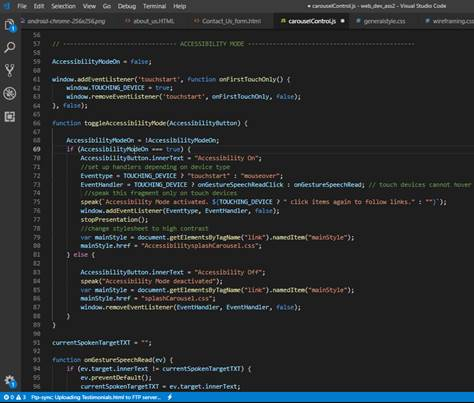

# JS Wedding Planners

[Working Project](https://osmiogrzesznik.github.io/js-wedding-planners/index.html)

Static Website with speech synthesis for accessibility. Coursework.

## Table of Contents 
=================

[Design 3](#design)

[Design - Home page 3](#design---home-page)

[Design -- About Us page 5](#design-about-us-page)

[Design -- Contact Us page 7](#_Toc532649152)

[Realisation -- Home page 7](#_Toc532649153)

[Realisation. 8](#realisation.)

[Realisation -- Home Page. 8](#realisation-home-page.)

[Realisation -- Home page -- Accessibility Mode 9](#section-1)

[Realistaion Presentation Mode - Mobile animations. 10](#section-4)

[Realisation -- Presentation Mode -- Desktop- ANIMATIONS
12](#realisation-presentation-mode-desktop--animations)

[Realisation - Contact Us page 13](#realisation---contact-us-page)

[Realisation - About Us page 14](#realisation---about-us-page)

[Thumbnail Icon 15](#thumbnail-icon)

[Accessibility Mode -- speech synthesis and stylesheet replacement
17](#accessibility-mode-speech-synthesis-and-stylesheet-replacement)

[Home Page -- Presentation Mode 18](#home-page-presentation-mode)

[Testing Functionality 19](#testing-functionality)

[Testing Speech Synthesis -- illustrations.
20](#testing-speech-synthesis-illustrations.)

[WAMP server 21](#wamp-server)

[References 22](#references)

[Source Code -- Plain Text (colour formatted)
22](#source-code-plain-text-colour-formatted)

[Index.html 22](#index.html)

[About\_us.html 25](#about_us.html)

[Contact\_Us\_form.html 27](#contact_us_form.html)

[generalstyle.css 30](#generalstyle.css)

[splashCarousel.css 37](#splashcarousel.css)

[site.webmanifest 44](#site.webmanifest)

[AccessibilitySplashCarousel.css 45](#accessibilitysplashcarousel.css)

[carouselControl.js 56](#carouselcontrol.js)

Design 
======

 Design - Home page
------------------

Technique known as wireframing , will help to focus on design goals.

Page

Modern institutions, banks , and high-street shops mount digital screens
on the display windows or in the reception/waiting room. Dennis et all
(2010) explores performance of this approach. This strategy allows
business to catch the attention of the customer and explain their
business through presenting dynamic and graphical content, without
referring to static, long and unattractive paragraphs , additionally
overcoming language-barrier in the first stage of customer engagement.
As JS Wedding Planners still have physical branch in Birmingham where
customers are served, they can easily utilise their website for these
purposes. Implementing this technique on the web is known as Splash
page, Welcome page. One of approaches engaging attention through
animation is Slider/Carousel Technique, achieved by moving sequence of
slides into main view. There is ongoing discussion in user experience
circles should Navigation Bar is to be avoided, especially in case of
small websites (Rizki, 2018).

Figure 1. Responsive layout on mobile devices.

Mobile version of layout in this case is modified only by reconfiguring
navigation structure.

Design -- About Us page
-----------------------

Figure 2 responsive layout on mobile devices

[]{#_Toc532649152 .anchor}Design -- Contact Us page.

Figure 3. responsive layout on mobile devices

Realisation.
============

Realisation -- Home Page.
-------------------------

Realisation -- Home page -- Accessibility Mode
----------------------------------------------

Realistaion Presentation Mode - Mobile animations.
--------------------------------------------------

Figure 4.Ongoing Animation screenshots - Mobile IOS.

Realisation -- Presentation Mode -- Desktop- ANIMATIONS 
-------------------------------------------------------

Figure 5.Ongoing Animation screenshots - Desktop

Realisation - Contact Us page
-----------------------------

Realisation - About Us page
---------------------------

Thumbnail Icon
==============

logos are substantial element of brand identification, modern browsers
and OS offer ways to signify your brand identity through icons, home
button icons, helping user to navigate between open tabs , or native
selection elements. By saving image files to root of our page we
indicate these systems to display our logo as a thumbnail. Favicon file
, and properly sized png images have to be saved with browser
configuration manifests that meet specification.

Figure 6. Icon shows properly in native environments. From top left:
iOS, Android Home Button, Android Firefox, Whatsapp Sharing Function,
Desktop Chrome, Desktop Firefox .

Accessibility Mode -- speech synthesis and stylesheet replacement
=================================================================

Utilised modern browser capabilities to synthesise speech for disabled
users. First , small script detects if device is touch enabled, avoiding
use of browser API, that proves not completely compatible with variety
of devices using different input method. Simplest method is to listen
for touch event, as this provides the full-proof evidence of touch
enabled device.

Home Page -- Presentation Mode
==============================

Testing Functionality
=====================

Testing Speech Synthesis -- illustrations.
==========================================

Figure 7. Testing Accessibility Mode Speech in Firefox and Chrome.

WAMP server
===========

I ran Wamp server on my computer since year and managed to configure it
in such a way, that it is accessible online in my LAN . I run Private
projects utilising WAMP and LAN websockets communication, thus to avoid
risk of loosing proper configuration, or some of projects, I decided to
not reinstall the server. As a consequence there is no screenshots
illustratinginstallation process. As an Alternative Solution, I deployed
the project by FTP on free webhosting service, X10Hosting.com,
accessible under the link
.<http://www.produccio.x10host.com/JSWeddingPlanners/A/>

Figure 8. WAMP server running on localhost, with full LAN access.

References
==========

-   Rizki, R. R. (2018) *3 Good Reasons Why You Might Want to Remove
    that Hamburger Menu from Your Product*, *Muzli - Design
    Inspiration*. Available at:
    https://medium.muz.li/3-good-reason-why-you-might-want-to-remove-that-hamburger-menu-from-your-product-69b9499ba7e2
    (Accessed: December 15, 2018).

-   Dennis, C., Newman, A., Michon, R., Josko Brakus, J. and Tiu
    Wright, L. (2010). The mediating effects of perception and emotion:
    Digital signage in mall atmospherics. *Journal of Retailing and
    Consumer Services*, 17(3), pp.205-215.

